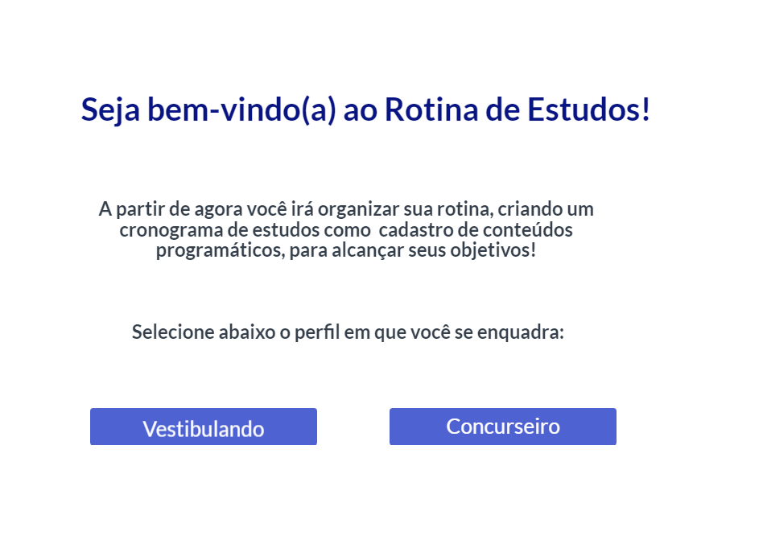

# Projeto de Interface

Dentre as preocupações para a montagem da interface do sistema, estamos estabelecendo foco em questões como agilidade, acessibilidade e usabilidade. Desta forma, o projeto tem uma identidade visual padronizada em todas as telas que são projetadas para funcionamento em desktops e dispositivos móveis.

## Fluxo do Usuário

O diagrama apresentado na Figura 2 mostra o fluxo de interação do usuário pelas telas do sistema. Cada uma das telas deste fluxo é detalhada na seção de Wireframes que se segue. Para visualizar o Wireframe interativo, acesse o [ambiente MarvelApp do projeto](https://marvelapp.com/prototype/662f72a).

## Wireframes

Conforme fluxo de telas do projeto, apresentado no item anterior, as telas do sistema são apresentadas em detalhes nos itens que se seguem. 

## Tela - Home-Page

A tela de home-page deseja as boas-vindas ao usuário e permite que ele selecione o perfil em que se enquadra. 

●	Se o usuário selecionar a opção vestibulando, será direcionado para a página de cadastro.

●	Se o usuário selecionar a opção concurseiro, será direcionado para a página de cadastro.

## Tela - Cadastro
A tela Cadastro permite ao usuário preencher com seu nome completo, e-mail, CPF e telefone celular e ter seus conteúdos e acesso salvos automaticamente em seu navegador local.  O usuário deverá aceitar os termos e política de privacidade para concluir o cadastro.  

## Tela – Página Principal Vestibulando
Assim que o usuário efetua o cadastro, ao ter clicado inicialmente em vestibulando, ele será direcionado para a página principal do vestibulando. Nesta tela ele terá acesso aos tópicos das áreas de conhecimento e deverá preencher com os conteúdos a serem estudados. No canto direito superior, encontra-se o menu Minha conta para fazer a edição do cadastro e o menu Relatório que apresenta seu progresso. 

## Tela - Página Principal Concurseiro
Assim que o usuário efetua o cadastro, ao ter clicado inicialmente em concurseiro, ele será direcionado para a página principal do concurseiro. Nesta tela ele terá acesso aos tópicos dos conteúdos programáticos e deverá preencher com os conteúdos a serem estudados. No canto direito superior, encontra-se o menu Minha conta para fazer a edição do cadastro, o menu Meu Edital para anexar o link do edital e o menu Relatório que apresenta seu progresso. 

## Tela - Cadastro de Novo Concurseiro
A tela permite que o usuário cadastre um novo conteúdo, escolhendo um título, fazendo uma descrição, estipulando prazo e podendo atualizar o status da tarefa conforme for progredindo. Ao clicar em adicionar conteúdo, o usuário será direcionado para sua tela principal e visualizará o novo conteúdo embaixo do tópico selecionado.

## Tela – Conteúdos cadastrados
A tela apresenta os tópicos com os conteúdos cadastrados. O usuário poderá editar ou remover os conteúdos ao longo de seus estudos.

## Tela – Edição de Conteúdo
Na tela que permite ao usuário editar o conteúdo, deve-se informar o título, descrição, prazo, status e a opção de salvar as alterações. Caso o usuário opte por manter as informações como estavam, ele poderá cancelar a operação. Após finalizar o cancelamento ou salvar, o usuário será redirecionado para a página principal.

  
 ## Tela – Remoção de Conteúdo
Na página principal, o usuário poderá escolher a remoção do conteúdo cadastrado. Ao clicar em remover, ele será direcionado para a página de remoção de conteúdo que apresentará a mensagem de que ele está prestes a remover o conteúdo que compõe sua rotina de estudos e, uma vez removido, não será possível recuperá-lo. Se o usuário desejar confirmar a remoção, ele deverá clicar no botão vermelho que apresenta a mensagem confirmar remoção. Caso, ele opte por não remover, basta clicar em cancelar. Após finalizar o cancelamento ou remoção, o usuário será redirecionado para a página principal. 

## Tela – Edição de Cadastro

Na página principal, o usuário poderá acessar o tópico minha conta, que direcionará o usuário à página que permite fazer edições em seu cadastro ou excluir a conta. Se o usuário desejar editar seus dados, basta fazer a alteração e clicar em salvar. Caso queira excluir a conta, ele deverá clicar no botão vermelho que apresenta a mensagem excluir minha conta. Após salvar ou excluir, o usuário será redirecionado para a página principal. 

## Tela – Confirmação de Cancelamento de Conta

Na página edição de cadastro, o usuário que selecionar a opção excluir minha conta, será direcionado para a página de confirmação de cancelamento de conta, que apresentará a mensagem que após removida a conta não será possível recuperá-la e para dar continuidade basta clicar no botão confirmar exclusão. Caso o usuário decida não excluir, ele poderá cancelar a operação. Após a exclusão ou cancelamentor, o usuário será redirecionado para a página principal.

## Tela – Acompanhe seu Progresso
Na página principal, o usuário poderá acessar o tópico relatório, que direcionará o usuário à página que permite acompanhar o seu progresso. Nesta página o usuário acompanhará a quantidade de conteúdos cadastrados, as tarefas não iniciadas, em andamento e as concluídas. Se o usuário estiver com várias atividades cadastradas e nenhuma concluída, aparecerá uma dica para que ele inicie os estudos. Se a quantidade de tarefas cadastradas e concluídas forem iguais, o usuário receberá uma mensagem de parabéns como incentivo. Ele poderá acompanhar o status de sua evolução pelo indicador colorido posicionado em frente o tópico meu desempenho. Se não houver iniciado nenhuma atividade o círculo ficará vermelho, quando estiver com tarefas em andamento ficará amarelo e quando concluir todos os conteúdos, ficará verde. Após a conferência, o usuário retornará à página principal clicando em voltar. 

## Tela – Inclusão do Edital
Na página principal, o usuário poderá acessar o tópico meu edital, que direcionará o usuário à página que permite incluir o link do seu edital e fazer anotações úteis. Se o usuário fizer as edições, ele deverá salvar clicando no botão verde, e caso, opte por não incluir nenhum item, basta cancelar. Após salvar ou cancelar, o usuário será redirecionado para a página principal.

